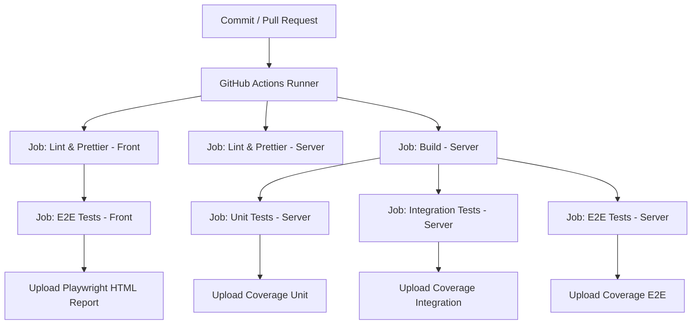

## Testes end-to-end no frontend

Este projeto demonstra como estruturar e executar testes end-to-end (E2E) no frontend com Playwright, Docker e CI/CD no GitHub Actions.
A aplicação é composta por Node.js/Express no backend e React + Vite no frontend, integrados a PostgreSQL e Redis.


--- 

### 🎯 O que são Testes E2E?

Testes end-to-end simulam o comportamento real do usuário, validando fluxos completos da aplicação, como:
- Registrar um novo usuário;
- Fazer login e navegar até o dashboard;
- Alterar a senha e manter a sessão válida;
- Tratar erros de autenticação (ex.: token inválido ou expirado);
Enquanto testes unitários validam funções isoladas e testes de integração verificam módulos combinados, os E2E garantem que frontend + backend + banco funcionam em conjunto como um sistema real.


---

### 🛠️ Tecnologias Utilizadas

- Node.js + Express – backend
- React + Vite – frontend
- PostgreSQL – persistência de dados
- Redis – blacklist de tokens JWT
- Playwright – framework de testes E2E
- Page Object Pattern (POP) – abstração para interações estáveis com a UI
- Nginx – servidor estático e proxy reverso `/api → backend`
- Docker & Docker Compose – isolamento de ambiente
- GitHub Actions – pipeline de CI/CD


---

### 📂 Estrutura de Pastas

```bash
app/
├── .github/
│   └── workflows/
│       └── ci.yml
│
├── db/                     
│   └── init.sql 
│
├── front/  
│   ├── src/                # Código do frontend (React + Vite)
│   ├── tests/
│   │   ├── e2e/            # Cenários de testes (specs)
│   │   │   ├── changePassword.spec.ts
│   │   │   ├── dashboard.spec.ts
│   │   │   ├── login.spec.ts
│   │   │   └── register.spec.ts
│   │   └── pages/          # Page Objects (POPs)
│   │       ├── ChangePasswordPage.ts
│   │       ├── DashboardPage.ts
│   │       ├── LoginPage.ts
│   │       └── RegisterPage.ts
│   ├── Dockerfile.e2e.front   # Build front + stage de testes Playwright
│   ├── Dockerfile.production
│   ├── nginx.e2e.conf         # Proxy API → node-e2e-front
│   ├── nginx.production.conf  # Proxy para ambiente produtivo
│   ├── package.json
│   └── playwright.config.ts   # Configuração Playwright
│
├── server/  
│   ├── src/                   # Código do backend        
│   ├── tests/                 # Unit, integration e e2e do backend 
│   │   ├── e2e/
│   │   ├── integration/        
│   │   └── unit/
│   │
│   ├── Dockerfile.e2e.front    # Usado por e2e da pasta front
│   ├── Dockerfile.e2e.server   # Usado por e2e da pasta server
│   ├── Dockerfile.integration
│   ├── Dockerfile.production
│   ├── Dockerfile.unit
│   ├── jest.integration.config.js
│   ├── jest.e2e.config.js
│   ├── jest.unit.config.js
│   └── package.json
│
├── .dockerignore
├── .env.e2e
├── .env.integration
├── .env.production
├── docker-compose.e2e-server.yml
├── docker-compose.integration.yml
├── docker-compose.production.yml
└── docker-compose.unit.yml

```


---

### ▶️ Execução Local


1. Clonar o repositório

```bash
git clone https://github.com/arleysouza/e2e-front-test.git app
cd app
```

2. Subir aplicação em modo de produção
```bash
docker compose --env-file .env.production -f docker-compose.production.yml up --build -d
```
Encerrar e remover containers
```bash
docker compose --env-file .env.production -f docker-compose.production.yml down -v
```
O arquivo `/http/requests.http` contém as requisições da aplicação (login, registro, logout, change password).  
Para executá-las diretamente no VSCode, instale a extensão:  
👉 REST Client (autor: Huachao Mao)  
Após instalar, basta abrir o arquivo `requests.http`, clicar em `Send Request` sobre a requisição desejada, e o VSCode mostrará a resposta no editor.  

3. Testes End-to-End no frontend (modo direto)
```bash
cd front
npm run test:e2e
```
⚠️ Atenção: isso roda contra o banco de produção. Prefira usar o ambiente isolado em Docker.  

4. Rodar testes unitários
```bash
docker compose -f docker-compose.unit.yml up --build -d
```
Encerrar e remover containers
```bash
docker compose -f docker-compose.unit.yml down -v
```  

5. Rodar testes de integração
```bash
docker compose --env-file .env.integration -f docker-compose.integration.yml up --build --abort-on-container-exit --exit-code-from node-integration-test
```
⚠️ Os containers são finalizados após concluir os testes.   
Remover containers
```bash
docker compose -f docker-compose.integration.yml down -v
```

6. Rodar testes end-to-end no servidor
```bash
docker compose --env-file .env.e2e.server -f docker-compose.e2e-server.yml up --build --abort-on-container-exit --exit-code-from node-e2e-test
```
⚠️ Os containers são finalizados após concluir os testes.  
Remover containers
```bash
docker compose -f docker-compose.e2e-server.yml down -v
```

7. Rodar testes end-to-end no front (recomendado)
```bash
docker compose --env-file .env.e2e.front -f docker-compose.e2e-front.yml up --build --abort-on-container-exit --exit-code-from front-e2e-test
```
⚠️ Os containers são finalizados após concluir os testes.  
Remover containers:
```bash
docker compose -f docker-compose.e2e-front.yml down -v
```  
📌 **Observação**
- Os logs no terminal podem mostrar apenas parte da saída (ex.: *Running 11 tests…*).
- Para ver os resultados completos, rode sem `-d` (modo attached) ou consulte os logs no Docker Desktop.  


--- 

### 🔑 Page Object Pattern (POPs)

Cada tela da aplicação possui uma classe em `tests/pages/`, encapsulando ações e validações.  
Isso garante testes mais limpos, reutilizáveis e estáveis.  
Exemplo simplificado (`LoginPage`):
```ts

export class LoginPage {
  readonly page: Page;

  async goto() {
    await this.page.goto("/login");
  }

  async fillUsername(username: string) {
    await this.page.fill("[data-testid='login-username']", username);
  }

  async fillPassword(password: string) {
    await this.page.fill("[data-testid='login-password']", password);
  }

  async submit() {
    await this.page.click("[data-testid='login-submit']");
  }

  async expectError(message: string) {
    const errorLocator = this.page.locator("[data-testid='login-error']");
  }
}

```


---

### ⚙️ Configurações do Nginx

**Nginx**
- `nginx.production.conf` → Proxy `/api` → `node-app:3000`  
- `nginx.e2e.conf` → Proxy `/api` → `node-e2e-front:3000`  
    - usado para rodar Playwright em ambiente isolado.

**Playwright (`playwright.config.ts`)**
```ts
const baseURL =
  process.env.CI === "true"
    ? "http://front-e2e-front:80"
    : `http://localhost:${process.env.FRONT_HOST_PORT || 3003}`;
```
- Retries: até 2x em caso de falhas intermitentes
- Headless: sempre em CI
- Trace/screenshots/vídeos: facilitam debug de falhas  


---

### 🚀 Pipeline no GitHub Actions

O CI definido em `.github/workflows/ci.yml` roda os seguintes jobs:
- Lint & Prettier (Server) – verifica qualidade e formatação do código do backend;
- Lint & Prettier (Front) – verifica qualidade e formatação do código do frontend;
- Build (Server) – compila o TypeScript do backend.
- Unit Tests (Server) – roda com `docker-compose.unit.yml`, validando funções isoladas com mocks.
- Integration Tests (Server) – roda com `docker-compose.integration.yml`, garantindo interação entre módulos com Postgres e Redis reais.
- E2E Tests (Server) – roda com `docker-compose.e2e-server.yml`, simulando fluxos completos contra a API rodando em containers.
- E2E Tests (Front) – roda com `docker-compose.e2e-front.yml`, usando Playwright para validar a aplicação React servida pelo Nginx, integrada ao backend em containers.

Cada etapa publica relatórios de cobertura (`coverage/`) como artefatos no GitHub Actions (quando aplicável).



